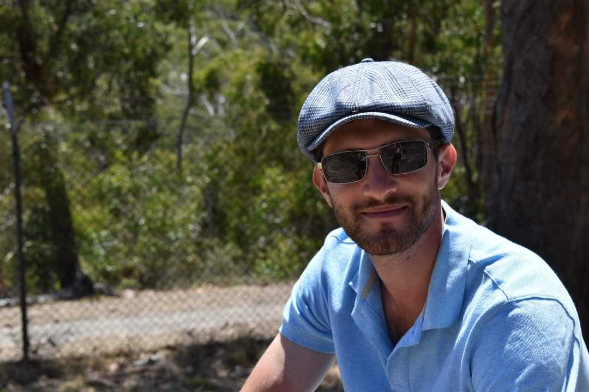

<!DOCTYPE html>
<html>
<head>
<title>Assignment 1</title>
</head>
<body>
<h1>My IT Profile</h1>

<h1>Personal Information</h1>

Born in Melbourne and raised in Adelaide, Australia to immigrant parents I unfortunately speak only one language, English. One of these days I might recruit a Babbel course in Italian or Indian and step in where my parents left off. Luckily for myself and my siblings the cultural fusion of our parents made for the best cuisine growing up. After finishing at Blackwood High School, I’ve worked in agriculture since 2016. In my spare time I play acoustic guitar, appreciate wine and whiskey, and take my dog Winston for hikes.

</body>
</html>
<h2>Interest in IT</h2>

IT has always been interesting to me whether it was the arrival of GPS systems alleviating the need to be a constant front seat navigator. The steady rise of gaming, which was a great relief from having only one boardgame, monopoly. This led to me being the household IT support, whereby I would turn it of and on again and to the amazement of my parents, it worked.
By taking this course I’m aiming at a career shift, for an industry which is becoming more and more prevalent in our daily lives. I’m quite interested in how IT is being used for everyday assistance, for example, the Alexa, Siri and Google Home programs. Another field of IT which has drawn my interest though I currently understand it only a little, is Deep Learning.

</body>
</html>
<h3>My Ideal Job</h3>

Content about me...

<h1>My Personality Profiles</h1>

While these results are providing an informative breakdown of character traits that most people can intuitively understand about themselves, they mainly function as a visual guide to other people of a someone’s general character. It was quite interesting to me to see how my results compared (as a percentage) against others in the population, and in comparison, to how I see myself. I agree with the assertiveness, thinking and prospecting characteristics for example, but was surprised by the level of extraversion and intuitiveness. While Debaters are described as being ruthlessly argumentative for fun and fascination (which is true) the disregard of another’s feelings when communicating s too straightforward and devoid of context. While this can often be the case, the lack of consideration in argument depends largely on who is involved in a conversation and how well ideas are received as well as delivered. An experienced communicator (especially one versed in debating tactics) can be aware of the effect their words will have, or conversely so an inexperienced speaker. I found the results of The Big Five test quite intriguing. While I would have considered myself accurately represented by the Neuroticism, Openness to Experience and Conscientiousness traits, I was surprised by the remaining two. However, upon reading into the detailed breakdown of these traits into subcategories I now consider them more representative. I wouldn’t normally consider myself that extraverted but I do enjoy engaging in experiences when I recognize them to be something out of the norm and tend towards cheerfulness. The secondary chart indicates having scored low on Gregariousness and Excitement-Seeking. Once again, this partitioning of characteristics is useful for identifying traits within myself which I might understand intuitively, but haven’t yet intellectually understood. 

The detailed results indicate that Debaters engage well when brainstorming, can offer new solutions, instigate robust conversations and invite participation. They can create friction with colleagues as their argumentative style of communicating may be irksome or aggravating. These are attributes I have recognized within myself for quite some time and this test has helped me realise it once more. Being aware of the flaws in oneself is the only way to try and negate the worst outcomes. In a team environment I would definitely try and follow my natural tendencies to spark conversation, but would aim to temper pushing too far. The results also show that I may be better suited to coming up with new ideas or methods, which would indicate that I ought to engage others on how to implement them. Within a team environment I would better serve myself and the other members by exploring our collective attention to detail and differing approaches to address a concept. As someone who isn’t typically stressed and has a score in trait agreeableness, I may be able to act as a potential mediator and maintain team morale. Having a team that can operate in concert is critical to having any cooperative work achieved. 

If I were to form a team, my primary concerns would be assembling a group who had as few points of friction and ease of communication as possible. As I am of a Debater personality I would perhaps prefer not to have to many similar people on the team as that may eventuate in too much discussion and too little action. It would also be beneficial to have someone on the team more oriented toward action and confirming a final decision. 

</body>
</html>
<h5>Project</h5>

Content about me...

